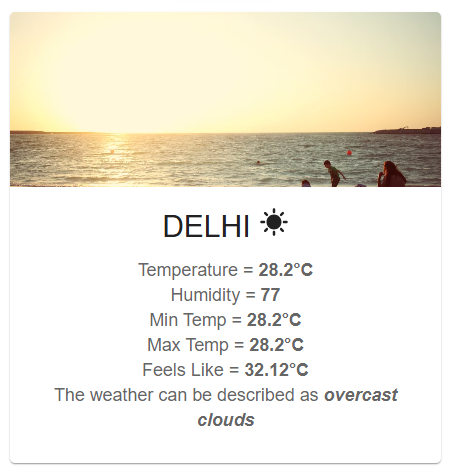

# 🌦️ Weather App

A simple weather application built with **React + Vite** and styled with **CSS + MaterialUI**.  
Search for any city and get live weather details from the [OpenWeather API](https://openweathermap.org/): temperature, humidity, min/max temp, feels like, and a short weather summary. Uses **Nominatim** for geocoding city names

---

## 📸 Screenshots

### 🔍 Search City

### 🌤️ Weather Results

---

## 🚀 Features

- 🔎 Search for any city worldwide
- 🌡️ Current temperature & "feels like"
- 💧 Humidity
- ▲ ▼ Min & Max temperature
- 📝 Short weather description (e.g. "Cloudy", "Clear")
- 🎨 Fully styled with **plain CSS and MaterialUI**

---

## 🛠️ Setup Instructions

1. **Clone the repository**  
   `git clone https://github.com/Shashwat-06/weather-app.git`  
   `cd weather-app`

2. **Install dependencies**  
   `npm install`

3. **Add your API key (required for the app to work locally)**  
   Open `src/SearchBox.jsx` and replace `<YOUR WEATHER APP API KEY HERE>` with your OpenWeather API key.  
   Example:  
   `const API_URL = https://api.openweathermap.org/data/2.5/weather?...&appid=<YOUR WEATHER APP API KEY HERE>&units=metric;`

4. **Start the development server**  
   `npm run dev`  
   Open: `http://localhost:5173`

---

## 🖥️ Usage

- Search box accepts city names (e.g. "Pune", "New Delhi").
- Results show: current temp, feels like, humidity, min/max, and short description.

---

## 🧰 Tech Stack

- ⚛️ React
- ⚡ Vite
- 🎨 Plain CSS
- 🎨 MaterialUI
- ☁️ OpenWeather API

---

## 🧩 Important Notes / Security

- **This project is made for practice purposes only and is not production-ready.**
- **Do not commit your real API key** into a public repo.
- For deployed apps, prefer calling your backend (server) to keep API secrets hidden, or use provider-side restrictions (domain/IP restrictions) if exposing keys client-side.

---

**✨ Made by Shashwat**
